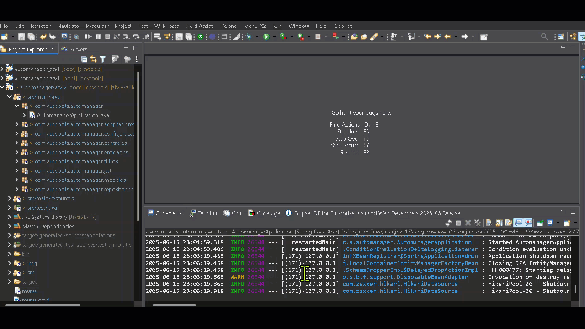
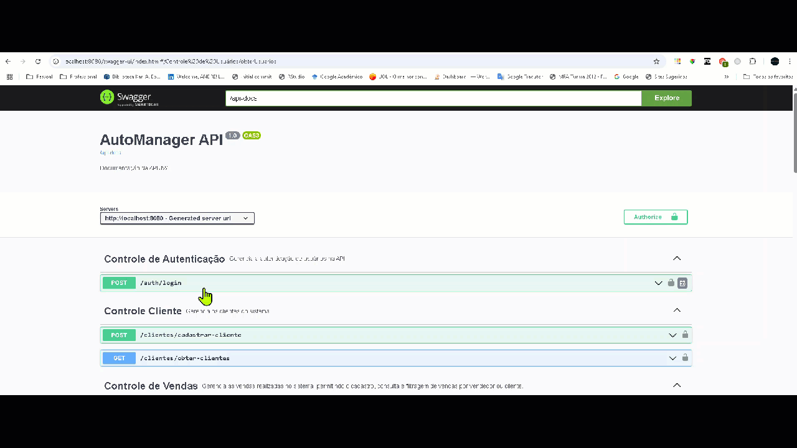
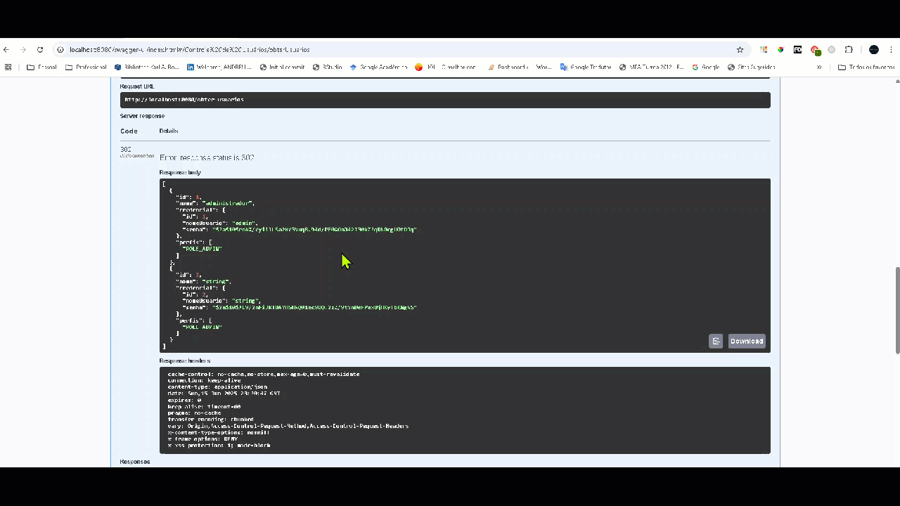
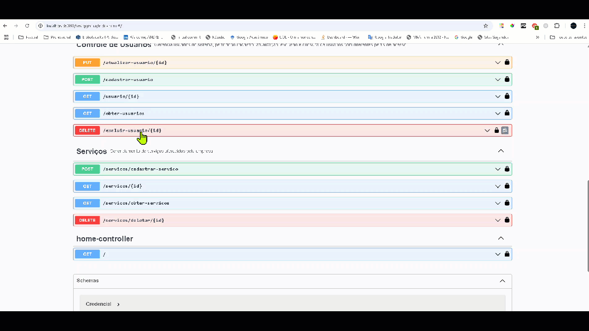
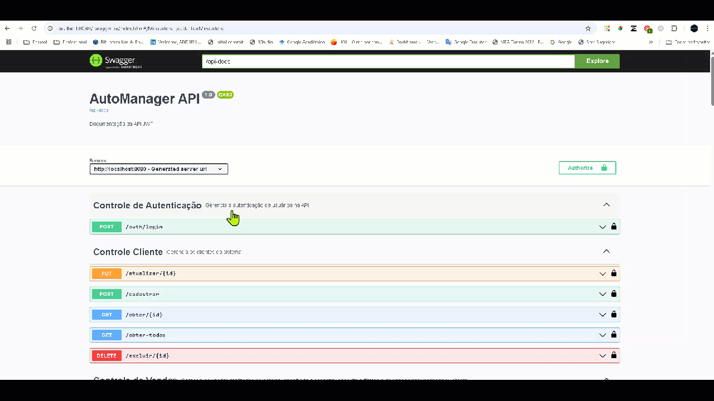

## Atividade IV

Empresa criada: AutoBots

Parceiros: Toyota Motor Corporation e Grupo Volskwagen

Fundador, Dev e Engenheiro de Software: André Salerno

## Objetivo

- implementação de uma atualização de segurança que consiste em incluir no sistema o processo de autenticação e autorização via JSON Web Token (JWT)

| **Perfil**     | **Autorizações** |
|----------------|------------------|
| **Administrador** | - Pode realizar todas as operações de CRUD na aplicação. ✅ <br>- Pode adicionar ou remover usuários administradores. ✅ |
| **Gerente**        | - Pode realizar todas as operações de CRUD sobre usuários dos perfis **gerente**, **vendedor** e **cliente**.<br>- Pode fazer todas as operações de CRUD sobre **serviços**, **vendas** e **mercadorias**. |
| **Vendedor**       | - Pode realizar todas as operações de CRUD sobre usuários do perfil **cliente**.<br>- Pode **ler** informações sobre **serviços** e **mercadorias**. ✅ <br>- Pode **criar vendas feitas por si mesmo** e **ler suas informações**. |
| **Cliente**        | - Pode **ler** informações sobre seu próprio cadastro.<br>- Pode **ler** informações de **vendas** das quais foi consumidor. |

Para atender essa necessidade, o seguinte código foi implementado:

```java
package com.autobots.automanager.modelos;

public enum Perfil {
	ROLE_ADMIN, ROLE_CLIENTE, ROLE_GERENTE, ROLE_VENDEDOR
}
```

## Entidades

| **Entidade**   | **Descrição**                                                                                                                                     |
|----------------|---------------------------------------------------------------------------------------------------------------------------------------------------|
| **Usuario**    | Representa qualquer pessoa com acesso ao sistema. Tem um nome, credenciais e um ou mais perfis (papéis).                                         |
| **Credencial** | Dados de autenticação do usuário (nome de usuário e senha). Relacionada 1:1 com `Usuario`.                                                       |
| **Perfil**     | Enumeração dos papéis do usuário: `ADMIN`, `GERENTE`, `VENDEDOR`, `CLIENTE`. Está relacionado com `Usuario`.                                     |
| **Servico**    | Representa um serviço que pode ser vendido. Pode ser gerenciado por gerentes, visualizado por vendedores e clientes.                             |
| **Mercadoria** | Representa um produto físico. Semelhante ao serviço em termos de acesso.                                                                         |
| **Venda**      | Representa uma transação. Está associada a um `Vendedor` (quem vende) e a um `Cliente` (quem compra). Contém itens como serviços ou mercadorias. |
| **ItemVenda**  | Representa os itens (serviço ou mercadoria) vendidos em uma `Venda`.                                                                             |

## Testes

Inicie a aplicação:

>

Acesse o site do Swagger: http://localhost:8080/swagger-ui/index.html#/

1) Administrador

1.1) Autenticação

```json
{
  "nomeUsuario": "admin",
  "senha": "123456"
}
```

>

1.2) Cadastrar admin e obter usuários

```json
{
  "id": 3,
  "nome": "robson",
  "credencial": {
    "id": 2,
    "nomeUsuario": "string",
    "senha": "string"
  },
  "perfis": [
    "ROLE_ADMIN"
  ]
}
```

>

1.3) Obter admin por ID e deletar

>

1.4) Atualizar usuário

>

1.4) Crud completo pelo admin na entidade cliente

>

1.5) Cadastro de todos os demais perfis com o admin

```json
[
  {
    "id": 1,
    "nome": "administrador",
    "credencial": {
      "id": 1,
      "nomeUsuario": "admin",
      "senha": "$2a$10$6T/DC4Lt4E6idX8miMBP9.9spAwVJ3ENziTGoD.ZkWtUD/vJzORb."
    },
    "perfis": [
      "ROLE_ADMIN"
    ]
  },
  {
    "id": 2,
    "nome": "vendedor1",
    "credencial": {
      "id": 2,
      "nomeUsuario": "vendedor1",
      "senha": "$2a$10$RAFbxy06fP16kUsDHYnZbu.md.CQ7CKK9xHiTMejZnXgQBs.YgFCm"
    },
    "perfis": [
      "ROLE_VENDEDOR"
    ]
  },
  {
    "id": 3,
    "nome": "cliente1",
    "credencial": {
      "id": 3,
      "nomeUsuario": "cliente1",
      "senha": "$2a$10$89pOmKMRVYaEdKgqQ5RrNurxNVv6Cd0zqbEE6HRswHWw79/EK5.OK"
    },
    "perfis": [
      "ROLE_CLIENTE"
    ]
  },
  {
    "id": 4,
    "nome": "gerente1",
    "credencial": {
      "id": 4,
      "nomeUsuario": "gerente1",
      "senha": "$2a$10$8g8G.SG2k8OV/efwao/ReeY5xyyUox.Zj8QzHeSfAv7.ldm/nyk/q"
    },
    "perfis": [
      "ROLE_GERENTE"
    ]
  }
]
```

Obs.: observe que as senhas já foram todas criptografadas. Lembre-se que a senha é o mesmo nome do usuário.

2. Vendedor

Obs.: náo pode criar mercadoria mas pode visualizar

>